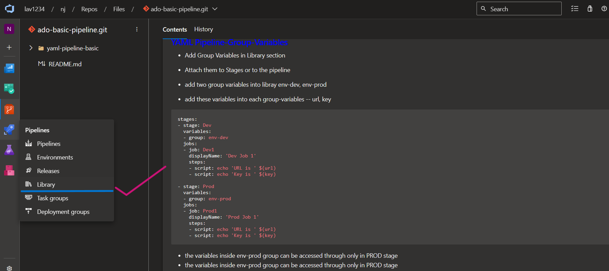
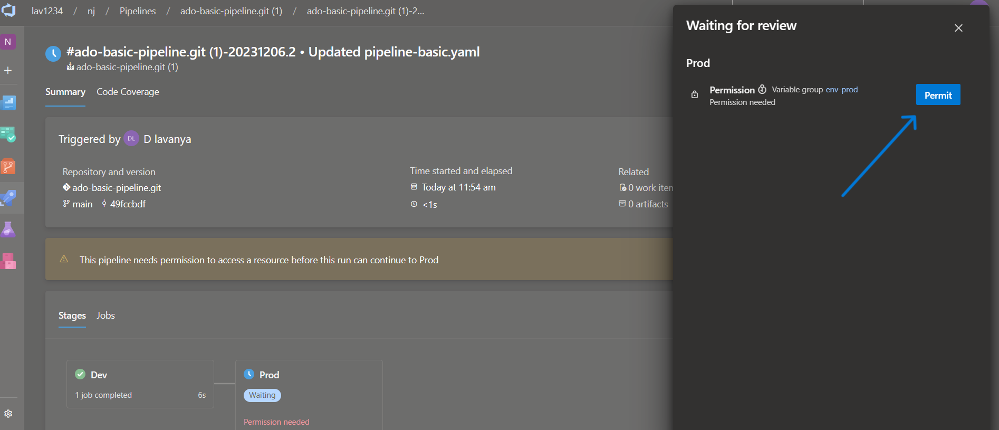

# **Running a Sample Yaml Pipeline in Azure DevOps**

# Table of contents
1.[Introduction](#**<Introduction>**)

2.[Prerequisites](#**<Pre-requisites>**)

3.[Running a Sample Yaml Pipeline in Azure DevOps](#how-to-run-a-sample-yaml-pipeline-in-azure-devops)

## **Introduction**

### **What is Azure DevOps**

Azure DevOps is a set of development tools and services offered by Microsoft as part of the Azure cloud platform. It provides a comprehensive set of features to support the entire DevOps lifecycle, from planning and coding to building, testing, and deploying applications. Azure DevOps aims to help development teams collaborate effectively and deliver high-quality software faster.

### **What is Yaml Pipeline**
A YAML pipeline typically refers to a configuration file written in YAML (YAML Ain't Markup Language) that defines a continuous integration/continuous deployment (CI/CD) pipeline for software development. YAML is a human-readable data serialization format, and it's commonly used to define configuration settings in a concise and easy-to-read manner.

***

## **Pre-requisites**

1.**Create Azure DevOps Account and make sure pipelines are all set to run**

2.**Install Visual Studio**

***

# **How to Run a Sample Yaml Pipeline in Azure DevOps**

Now, First we will clone the repository **ADO-BASIC-PIPELINE** in local Visual Studio Code.

### **1. Open your Visual Studio Code.**

***

### **2. Now open the Terminal and do Git Clone.**

### **3. Now , you have to see your reposirtory appearing on left side of the panel and checkout the code Pipeline-basic.yaml** .

***

### **4. Now , Open the Azure DevOps URL - dev.azure.com . Azure DevOps is a tool where we run the pipeline . So before we run pipeline we need to import respository here in Azure DevOps** .

### **4. Now , give the respevtive URL of the repository and click on import** .

### **5. We can see that , repository is imported successfully !** .

### **5. Now click on the pipeline to start the  process of running pipeline .**

### **6. Click on Azure Repos Git .**

### **7. Select the respective repostory of yours which you have imported.**

### **8. Click on Existing Azure Pipeline YAML file**

### **9. So here , select the path of your pipeline**

### **10. Now click on Run**

### **11. So , the pipeline started running , lets wait until it completes**

### **11. Pipeline is successfully running**

***

### **12. Now , lets explore and try to run YAML Pipeline with Variables**

### **13. Copy that code we shall replace that in pipeline-basic.yaml . so from 11th line just remove previous code and paste the code that we have taken from README.md**

### **14. Once replaced click on commit .**

### **15. So, Once commited just come back to the pipeline and click on New pipeline and you can see that their is one variable mentioned in the script i.e., myurl . we need to add varible up their with name myurl.**

### **16. Once variables added , Click on Run .**

### **17. Pipeline started running .**

### **17.Successfully Running .**

***

### **18. As we have tried with variables, Now lets explore and try to run YAML Pipeline with Group Variables**

### **19. Copy that code we shall replace that in pipeline-basic.yaml . so from 11th line just remove previous code and paste the code that we have taken from README.md**

### **21. Once replaced click on commit .**

### **22. Now lets add group variables in Library which are mentioned in the Script .**

### **23. Click on the Pipelines and select Library.**

### **24. Create Variable Group with name "env-dev" and Add URL & KEY with respective values**.

### **25. Create another Variable Group with name "env-prod" and Add URL & KEY with respective values**.

### **26. Once Group variables assigned , now run the pipeline , while you are running it will ask you to permit it before running , click on permit**.

### **27. As Dev is successfully ran , its asking to permit for prod**.

### **27. Pipeline is running successfully**.

***